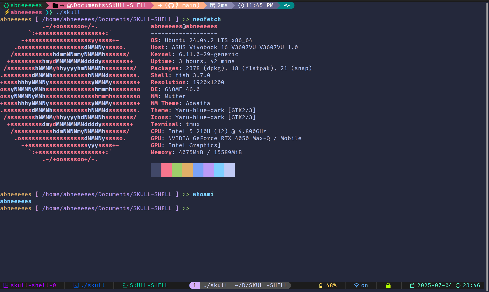

# 🦴 Skull Shell




**Skull Shell** is a feature-rich custom shell written in **C**, designed for developers and power users who want more control over their command-line experience. Built with modularity and extensibility in mind, Skull Shell provides essential shell functionality with room for advanced features.

---

## 🚀 Features

### Core Functionality
- 🔧 **Built-in Commands**: `cd`, `exit`, `echo`, `clear`, `pwd`, `help`, and more
- 🖥️ **Full External Command Support**: Execute **ANY** system command - `ls`, `cat`, `grep`, `ps`, `git`, `vim`, `gcc`, `make`, `curl`, `ssh`, and thousands more!
- 🔄 **Seamless Command Integration**: Automatically falls back to system commands when built-ins aren't found
- 💾 **Dynamic Memory Management**: Efficient memory allocation and cleanup
- 🎨 **Colored Output**: Visual feedback with color-coded messages
- 👤 **User Context**: Displays username and current directory in prompt

### Built-in Commands
- `cd` - Change directory
- `pwd` - Print working directory
- `echo` - Display text
- `clear` - Clear terminal screen
- `exit` - Exit the shell
- `-h` - Show help information

### External Commands (All System Commands Supported!)
**File Operations**: `ls`, `cat`, `touch`, `cp`, `mv`, `rm`, `mkdir`, `rmdir`, `head`, `tail`, `chmod`, `chown`, `find`, `locate`

**Text Processing**: `grep`, `sed`, `awk`, `sort`, `uniq`, `less`, `more`, `man`

**System Monitoring**: `ps`, `top`, `htop`, `free`, `df`, `du`, `uptime`, `whoami`, `uname`, `id`

**Network Tools**: `ping`, `curl`, `wget`, `ssh`, `scp`, `ftp`, `netstat`, `hostname`

**Development Tools**: `gcc`, `make`, `git`, `vim`, `nano`, `python`, `node`, `npm`

**Process Management**: `kill`, `killall`, `jobs`, `bg`, `fg`, `nohup`, `nice`

*...and literally ANY other command available on your system!*

### Planned Features
- 🔤 **Command Suggestions** - Autocomplete and suggest alternatives for mistyped commands
- 🎧 **Music Playback** - Play local audio files (`.mp3`, `.wav`, etc.)
- 🤖 **AI Integration** - AI-assisted commands using the `-ai` flag
- 🐞 **Script Debugging** - Shell script debugging with trace outputs
- 📁 **Enhanced File Handling** - Simplified file management operations

---

## 🏗️ Project Structure

```
shell/
├── images/           # images and ascii art
│   ├── skull.png     # demo image of skull
├── include/           # Header files
│   ├── commands.h     # Command declarations
│   ├── executer.h     # Command execution
│   ├── main.h         # Main includes and definitions
|   ├── memory.h       # commands history
│   ├── parser.h       # Input parsing
│   └── utils.h        # Utility functions
├── src/               # Source files
│   ├── commands.c     # Built-in command implementations
│   ├── executer.c     # Command execution logic
│   ├── main.c         # Main shell loop
|   ├── memory.h       # store and show history
│   ├── parser.c       # Input parsing and tokenization
│   └── utils.c        # Utility functions
├── makefile           # Build configuration
└── readme.md          # This file
```

---

## 🔧 Installation & Setup

### Prerequisites
- GCC compiler
- Make utility
- Linux/Unix environment

### Quick Start
1. **Clone or download the project**
2. **Navigate to the shell directory**
   ```bash
   cd SKULL-SHELL
   ```

3. **Compile the project**
   ```bash
   make
   ```

4. **Run Skull Shell**
   ```bash
   ./skull
   ```

---

## 💻 Usage

Once started, Skull Shell provides an interactive prompt showing your username and current directory:

```bash
> username /current/directory
```

### Example Commands
```bash
# Built-in commands
> pwd                    # Show current directory
> cd /home/user         # Change directory
> echo Hello World      # Print text
> clear                 # Clear screen

# External commands (just like any other shell!)
> ls -la                # List files with details
> cat myfile.txt        # Display file contents
> grep "pattern" *.txt  # Search in files
> ps aux                # Show running processes
> git status            # Git commands work too
> python script.py      # Run Python scripts
> gcc -o program main.c # Compile C programs
> make                  # Build projects
> curl api.example.com  # Make HTTP requests
> ssh user@server       # Connect to remote servers
> exit                  # Exit shell
```

---

## 🔍 Technical Details

### Architecture
- **Modular Design**: Separated into distinct modules for parsing, execution, and utilities
- **Memory Safe**: Dynamic memory allocation with proper cleanup
- **Process Management**: Fork-exec model for external command execution
- **Error Handling**: Comprehensive error checking and user feedback

### Key Components
- **Parser**: Tokenizes user input and handles command-line arguments
- **Executor**: Manages built-in vs external command execution
- **Command Handler**: Implements core shell commands
- **Utils**: Provides common utility functions

### Memory Management
- Dynamic buffer allocation for input handling
- Automatic memory cleanup after each command
- Reallocation for growing input buffers

---

## 🛠️ Development

### Building
```bash
make          # Standard build
make clean    # Clean object files
```

### Code Style
- Clean, readable C code
- Modular architecture with clear separation of concerns
- Comprehensive error handling
- Memory-safe programming practices

---

## 🤝 Contributing

Contributions are welcome! Areas for improvement:
- Additional built-in commands
- Command history and navigation
- Tab completion
- Configuration file support
- Advanced scripting features

---

## 📝 License


This project is licensed under the [GNU General Public License v3.0](https://www.gnu.org/licenses/gpl-3.0.en.html).

You are free to use, modify, and distribute this software under the terms of the GPLv3.  
See the [LICENSE](./LICENSE) file for full details.

---

**Built with ❤️ in C**

*Skull Shell - Where power meets simplicity*
